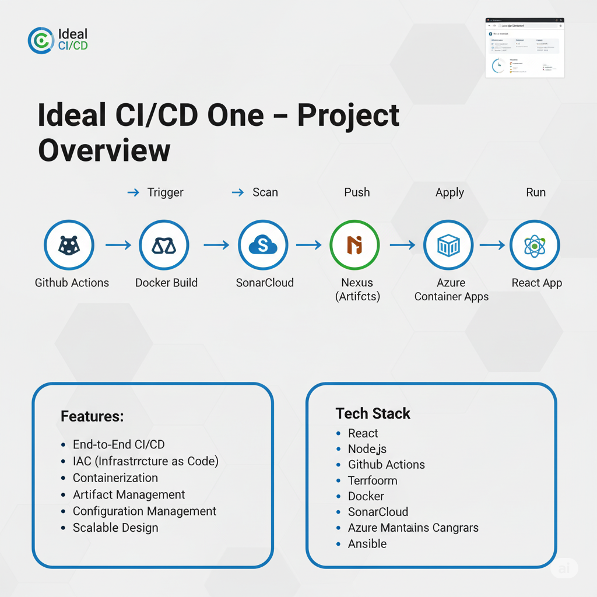
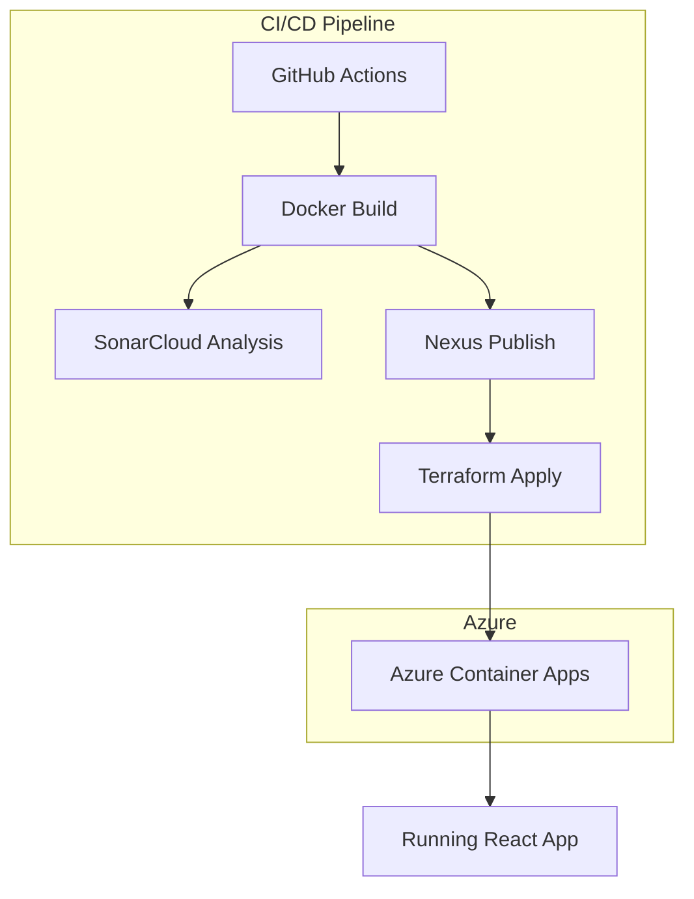
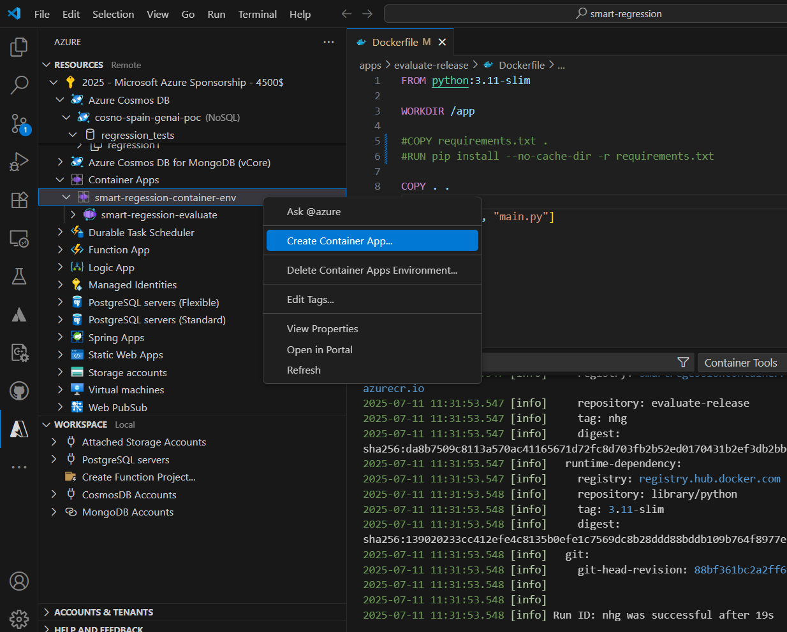
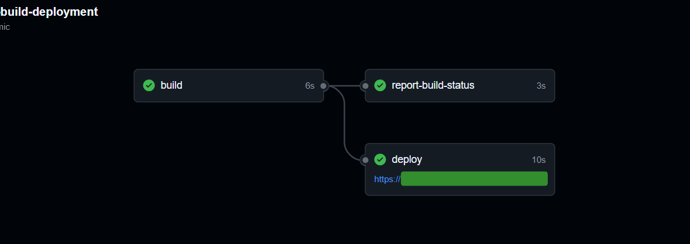

# Ideal CI/CD One



> **Ideal CI/CD One** is a comprehensive example project demonstrating modern DevOps practices for building, testing, packaging, and deploying a simple Node.js (React) application using GitHub Actions, Terraform, and Azure Container Apps. The project is modular and extensible, designed to showcase best practices for CI/CD pipelines, infrastructure as code, containerization, and integration with popular DevOps tools.

---

## Structure Overview

- **Application:** Simple React app (Node.js backend)
- **Infrastructure:** Terraform for IaC, Azure Container Apps for deployment
- **CI/CD:** GitHub Actions workflows
- **Integrations:** Docker, SonarCloud, Nexus, Ansible
- **Extensibility:** Modular design for future integration with Jenkins/Kubernetes

---

## Architecture Example



---

## Features

- **End-to-End CI/CD:** Automated build, test, and deployment pipeline
- **Infrastructure as Code:** Declarative provisioning with Terraform
- **Containerization:** Docker-based workflows for consistent environments
- **Quality Assurance:** Integrated SonarCloud code analysis
- **Artifact Management:** Nexus repository for container images
- **Configuration Management:** Ansible playbooks for post-deployment tasks
- **Scalable Design:** Ready for Jenkins/Kubernetes integration

---

## Tech Stack

| Layer           | Technology         | Purpose                        |
|-----------------|-------------------|--------------------------------|
| Frontend        | React             | User Interface                 |
| Backend         | Node.js           | API & App Logic                |
| CI/CD           | GitHub Actions    | Automation & Orchestration     |
| IaC             | Terraform         | Infrastructure Provisioning    |
| Containerization| Docker            | Build & Packaging              |
| Quality         | SonarCloud        | Code Analysis                  |
| Registry        | Nexus             | Artifact Storage               |
| Deployment      | Azure Container Apps | Hosting & Scaling           |
| Config Mgmt     | Ansible           | Post-deployment Configuration  |

---

## File Structure

```plaintext
ideal-cicd-one/
├── .github/
│   └── workflows/
│       └── ci-cd.yml           # GitHub Actions pipeline
├── app/                        # App React
│   ├── public/
│   ├── src/
│   │   ├── components/
│   │   ├── App.jsx
│   │   └── index.js
│   ├── package.json
│   ├── Dockerfile              # Dockerfile for React
│   └── .dockerignore
├── terraform/
│   ├── main.tf                 # Azure Container Apps
│   ├── variables.tf
│   ├── outputs.tf
│   └── providers.tf
├── ansible/
│   ├── deploy.yml              # Deployment Playbook
│   ├── configure.yml           # System Config
│   └── inventory/
│       └── azure.yml
├── docs/                       # Documentation
│   └── architecture.md
├── scripts/
│   ├── setup-infra.sh          # Script for automatic setup
│   └── local-test.sh
├── .gitignore
├── .dockerignore
├── sonar-project.properties    # SonarCloud config
├── docker-compose.yml          # Local testing
└── README.md
```

---

## Integrations

- **GitHub Actions:** Automated workflows for build, test, and deploy
- **SonarCloud:** Static code analysis for quality gates
- **Nexus:** Private Docker registry for image storage
- **Terraform:** Azure resource provisioning
- **Ansible:** Automated configuration management post-deployment

---

## Installation

1. **Clone the Repository**
    ```sh
    git clone https://github.com/your-org/ideal-cicd-one.git
    cd ideal-cicd-one
    ```

2. **Set Up Environment Variables**
    - Copy `.env.example` to `.env` and update values as needed.

3. **Build and Run Locally**
    ```sh
    cd app
    npm install
    npm start
    ```

4. **Run Docker Locally**
    ```sh
    docker build -t ideal-cicd-one-app .
    docker run -p 3000:3000 ideal-cicd-one-app
    ```

5. **Provision Infrastructure (Azure)**
    ```sh
    cd infra/terraform
    terraform init
    terraform apply
    ```

6. **Deploy via GitHub Actions**
    - Push changes to trigger CI/CD pipeline.

---

## Next Steps

- **Extend CI/CD:** Integrate Jenkins and Kubernetes for advanced orchestration.
- **Add Monitoring:** Incorporate Azure Monitor or Prometheus/Grafana.
- **Security:** Implement security scanning and secrets management.
- **Documentation:** Expand docs with troubleshooting and FAQ.
- **Contribute:** See [CONTRIBUTING.md](docs/CONTRIBUTING.md) for guidelines.

---




---

> _This project by **@hmosqueraturner** is for educational and demonstration purposes. Contributions and feedback are welcome!_
